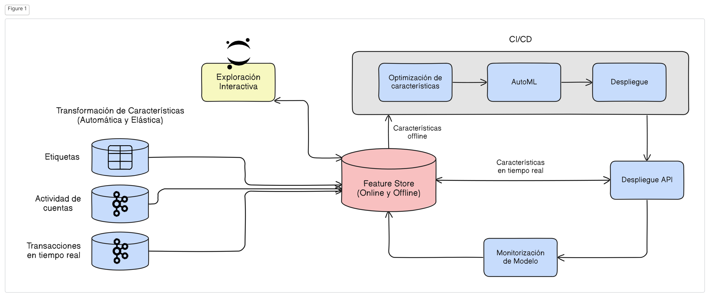

# Fraud Detection Demonstration with MLOps

This demonstration presents a solution for financial fraud prevention using MLRun’s feature store to define complex features that help identify fraudulent activities. Fraud prevention is a challenging task as it requires processing transactions and events in real time, responding quickly to block transactions before they are completed.

## Solution Approach

To address this problem, two pipelines are implemented:

- **Development Pipeline**: Allows testing and fine-tuning feature engineering logic and models.
- **Production Pipeline**: Uses the same features and models but is adapted to handle real-time data.

Additionally, data and model monitoring is automated, enabling the detection of deviations (drift) and triggering model retraining within a CI/CD pipeline. The complete process is illustrated in the following diagram:

## Project Implementation Steps

### Data Exploration and Analysis (EDA):

Understand the characteristics and structure of the data.

### Construction of the Data Ingestion and Preparation Pipeline:

Preprocess and transform data for use in models.

### Development of the Model Training and Validation Pipeline:

Train models using different features and algorithms.

### Development of the Application Service Pipeline:

Intercept requests, process real-time data, and make inferences.

### Data and Model Monitoring:

Detect deviations (drift) and evaluate model performance in production.

### Continuous Operations and CI/CD Management:

Automate continuous integration and deployment to keep models up to date.
